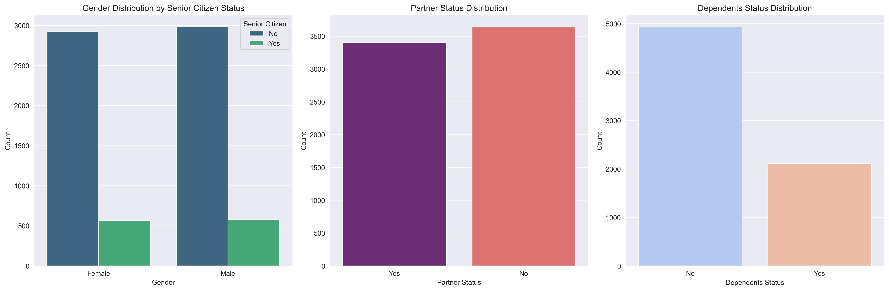
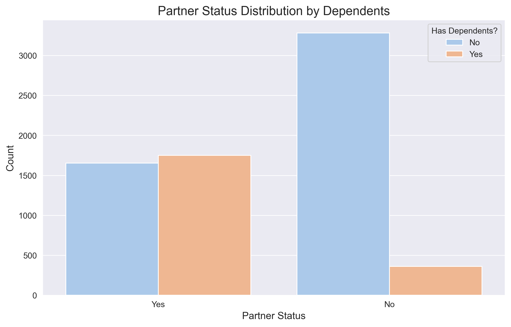
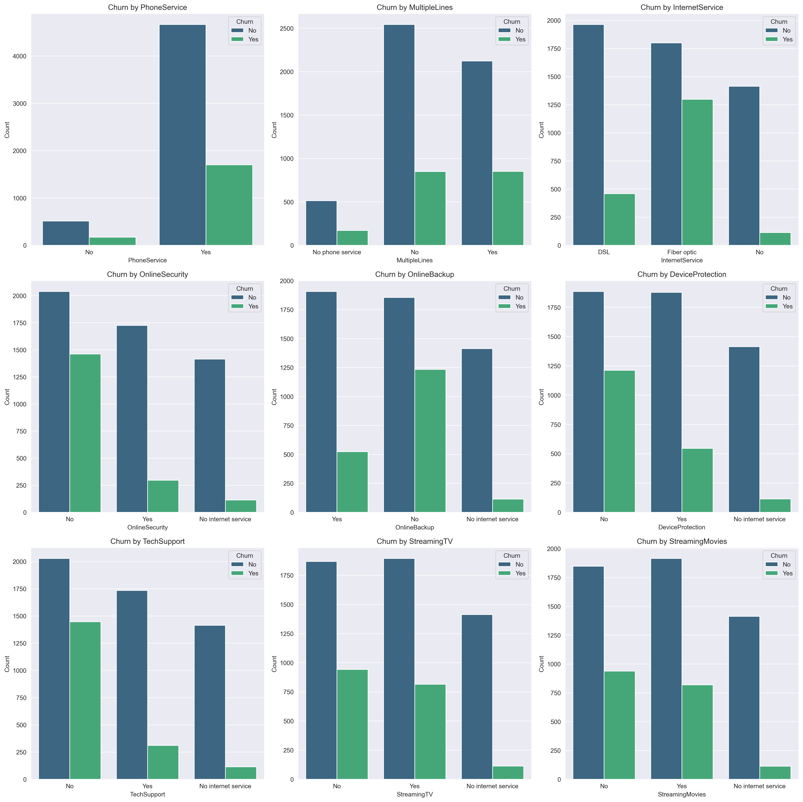
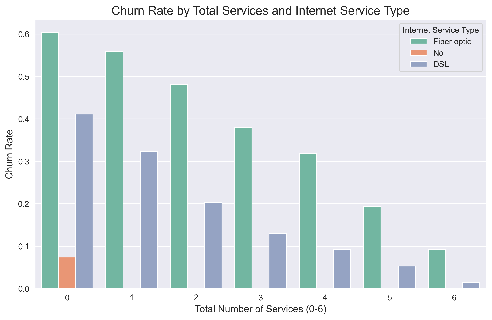
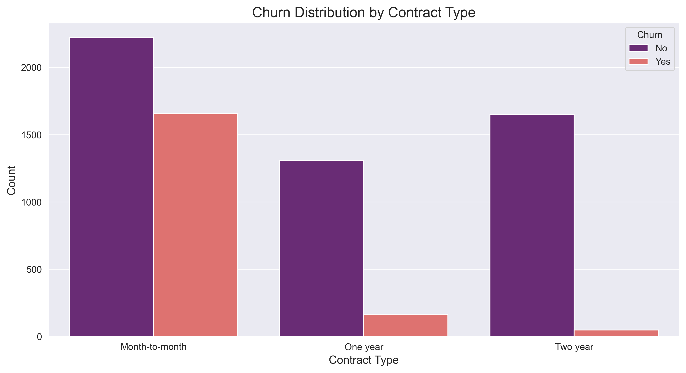
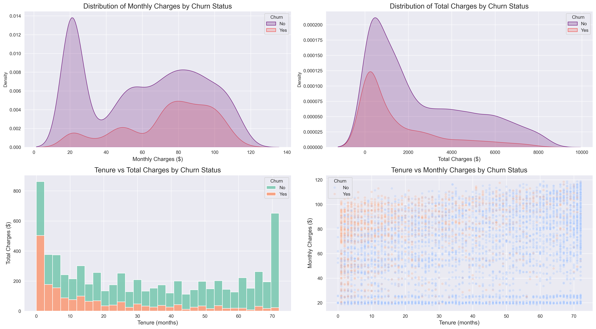

# 📊 Exploratory Data Analysis

## 1. Customer Demographics
First, I analyzed the basic demographic makeup of the customer base.

**Key Insights:**
* **Gender Balance:** The customer base is split almost equally between male and female.
* **Senior Citizens:** Seniors represent a small minority of the total customer base, indicating that the service is primarily used by younger or middle-aged demographics.

---

## 2. Household Composition & Segmentation
I investigated the relationship between having a partner and having dependents to better understand household "stickiness."

**Key Insights:**
* **The "Independent" Segment:** The largest single group consists of customers with no partner and no dependents. Historically, these "single" households are often higher churn risks.
* **Childless Couples:** Among customers with a partner, nearly 50% do not have dependents.
* **Single Parents:** This is the smallest segment in the dataset, showing that customers without partners rarely have dependents in this particular telco base.

---

## 3. 🛠️ Service Impact on Retention

I analyzed 9 different services to identify which ones act as "Anchors" (keeping customers loyal) and which are "Churn Magnets."

### 📊 Service Analysis Summary

| Service Category | Impact on Churn | Business Insight |
| :--- | :--- | :--- |
| **Fiber Optic Internet** | **High Risk** | Highest churn rate in the dataset; suggests pricing or stability issues. |
| **Online Security** | **High Retention** | Subscribed users are significantly less likely to leave (Peace of Mind). |
| **Tech Support** | **High Retention** | Acts as a strong "Anchor" service for long-term loyalty. |
| **Streaming Services** | **Moderate** | Associated with lower churn, likely due to the "Entertainment Bundle" effect. |
| **Phone/Multiple Lines** | **Neutral** | Shows no significant statistical difference in churn behavior. |

**Lower Churn Propensity:** There is a much higher proportion of "No Internet Service" customers in the "No Churn" category than in the "Churn" category.

**Key Takeaway:** The data suggests that "Protection" and "Support" services are the strongest drivers of customer retention. Moving customers from "DSL" to "Fiber" without addressing the high churn rate could be a financial risk for the company.

---

During the Exploratory Data Analysis (EDA), it became clear that **Internet Service Type** is not just a standalone feature, but a "deciding factor" that influences the behavior of all other variables.

### 🔍 Why Internet Service is the Primary Segment:
* **Feature Interdependence:** The availability and utility of "Value-Added Services" (Online Security, Streaming, etc.) are entirely dependent on whether a customer has an internet connection.
* **The "Confounding" Effect:** Customers with **No Internet Service** show high loyalty despite having zero add-on services. Without segmenting by `InternetService`, this group would "mask" the high churn risk of internet-using customers with low service counts.
* **Fiber Optic vs. DSL:** Even when subscribed to the same number of total services, Fiber Optic customers exhibit significantly higher churn rates than DSL customers, suggesting that technology type is a stronger driver of dissatisfaction than "bundling" is of loyalty.

---

## 📉 The "Bundle Effect" Segmented by Service Type
I visualized the relationship between the number of services and churn probability, using **Internet Service** as the grouping variable (`hue`) to reveal these hidden trends.

**Key Discovery:** For **Fiber Optic** users, the "Danger Zone" is having 0 or 1 service (Churn > 40%). For **No Internet** users, having 0 services is a "Safe Zone" (Churn < 10%). This confirms that internet type is the most critical segmenting factor for our predictive model.

---

## 📜 Contract Type: The Primary Churn Predictor

The analysis reveals that **Contract Type** is the single most significant indicator of customer churn.

**Key Findings:**
* **Month-to-Month Risk:** Customers on short-term plans are at extreme risk, with a churn rate significantly higher than long-term subscribers.
* **The "Lock-in" Effect:** Two-year contracts virtually eliminate churn, providing the company with long-term revenue stability.
* **Strategic Recommendation:** Transitioning Month-to-Month customers to at least a One-Year plan (through targeted discounts or value-add bundles) is the most effective way to reduce overall churn.

---

## 💸 Financial Analysis: Pricing & The "Onboarding Crisis"

I utilized a 2x2 distribution dashboard to identify the financial "tipping points" that lead to customer exit.

### 🔍 Key Insights from the Data:

* **The $70 Threshold (Monthly Charges):** Churn density peaks significantly between **$70 and $100**. This identifies "High-Cost" Fiber Optic plans as the primary financial trigger for churn.
* **The "Onboarding Crisis" (Total Charges):** Contrary to initial assumptions, the highest volume of churn occurs at very low **Total Charges** (near $0). This proves that the business is losing customers before they can build long-term value.
* **The "Survival Path" (Tenure vs. Total Charges):** As customers move past the 12-24 month mark, their churn probability drops to nearly zero. High Total Charges act as a **loyalty shield**—once a customer has invested significantly in the service, they are highly unlikely to leave.
* **High-Value Risk Zone:** The intersection of **High Monthly Charges** and **Low Tenure** (top-left of the scatter plot) represents the most volatile segment, where the company loses the most potential revenue.

> **💡 Business Strategy:** Retention efforts must be "front-loaded." The data suggests that if a customer survives the first year, they become a stable, long-term "Anchor" for the business.

---