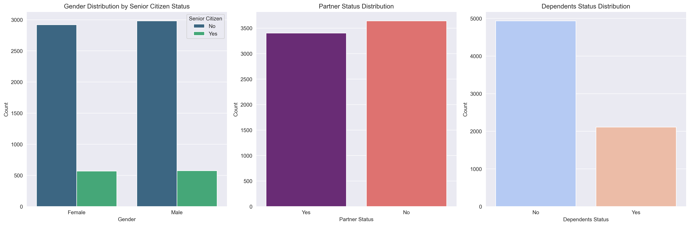
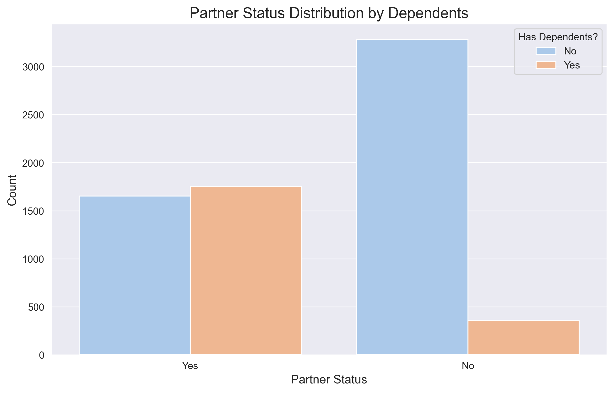
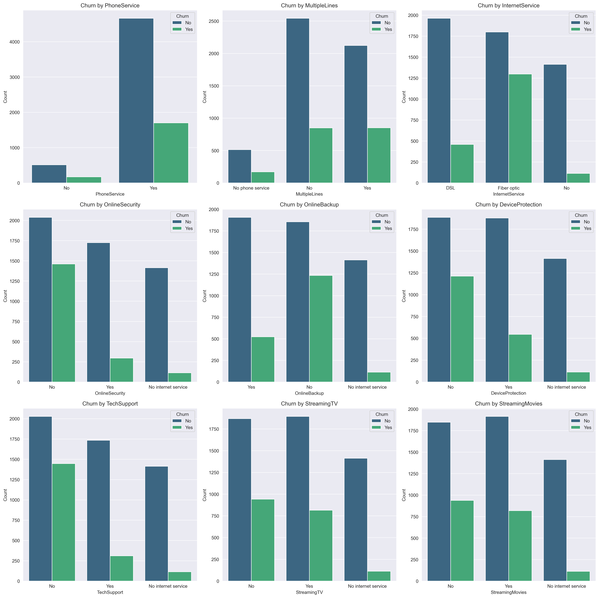
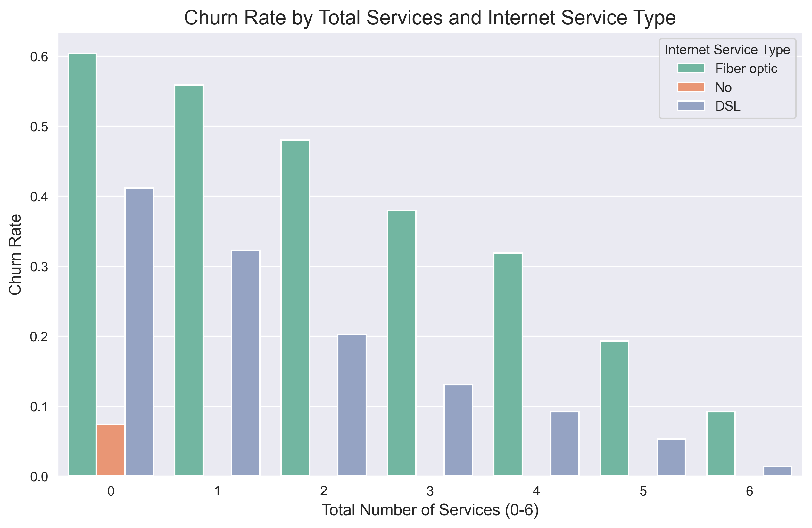
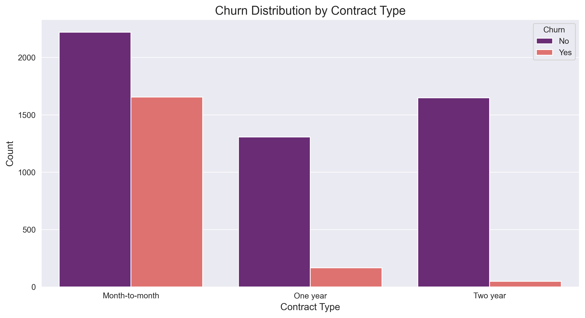
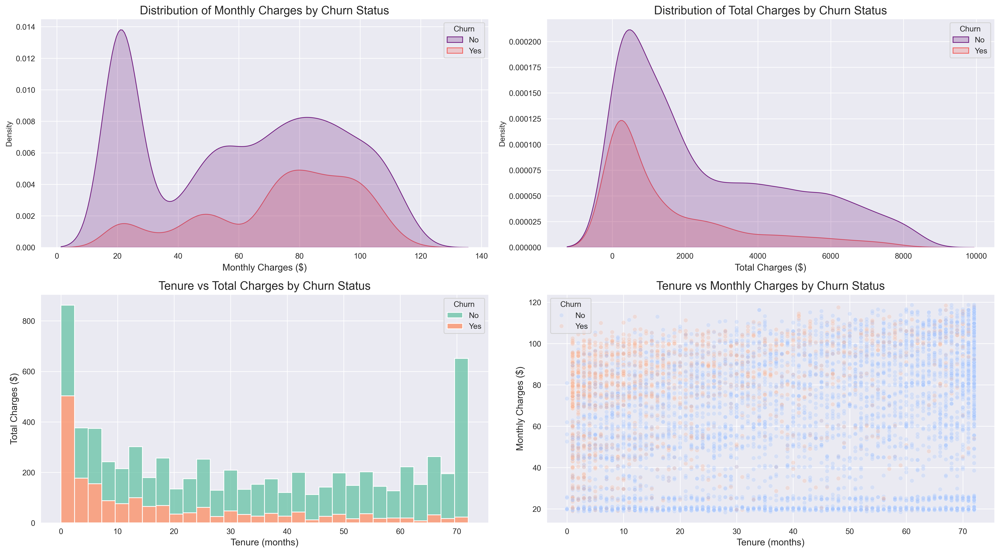
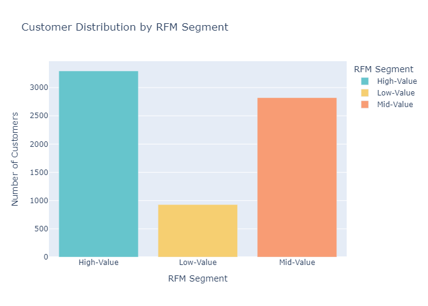
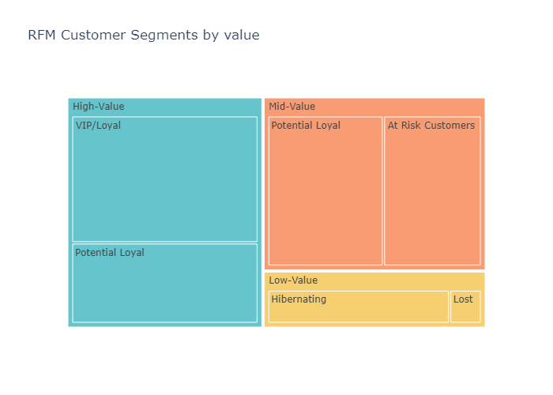
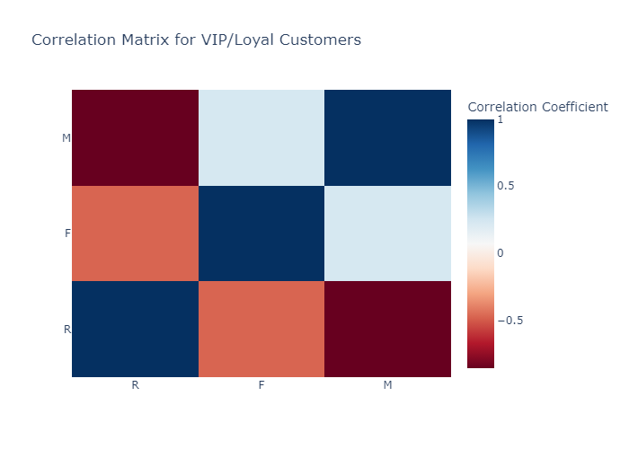
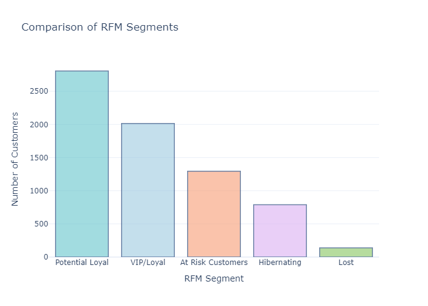

# 📊 Exploratory Data Analysis

## 1. Customer Demographics
First, I analyzed the basic demographic makeup of the customer base.

**Key Insights:**
* **Gender Balance:** The customer base is split almost equally between male and female.
* **Senior Citizens:** Seniors represent a small minority of the total customer base, indicating that the service is primarily used by younger or middle-aged demographics.

---

## 2. Household Composition & Segmentation
I investigated the relationship between having a partner and having dependents to better understand household "stickiness."

**Key Insights:**
* **The "Independent" Segment:** The largest single group consists of customers with no partner and no dependents. Historically, these "single" households are often higher churn risks.
* **Childless Couples:** Among customers with a partner, nearly 50% do not have dependents.
* **Single Parents:** This is the smallest segment in the dataset, showing that customers without partners rarely have dependents in this particular telco base.

---

## 3. 🛠️ Service Impact on Retention

I analyzed 9 different services to identify which ones act as "Anchors" (keeping customers loyal) and which are "Churn Magnets."

### 📊 Service Analysis Summary

| Service Category | Impact on Churn | Business Insight |
| :--- | :--- | :--- |
| **Fiber Optic Internet** | **High Risk** | Highest churn rate in the dataset; suggests pricing or stability issues. |
| **Online Security** | **High Retention** | Subscribed users are significantly less likely to leave (Peace of Mind). |
| **Tech Support** | **High Retention** | Acts as a strong "Anchor" service for long-term loyalty. |
| **Streaming Services** | **Moderate** | Associated with lower churn, likely due to the "Entertainment Bundle" effect. |
| **Phone/Multiple Lines** | **Neutral** | Shows no significant statistical difference in churn behavior. |

**Lower Churn Propensity:** There is a much higher proportion of "No Internet Service" customers in the "No Churn" category than in the "Churn" category.

**Key Takeaway:** The data suggests that "Protection" and "Support" services are the strongest drivers of customer retention. Moving customers from "DSL" to "Fiber" without addressing the high churn rate could be a financial risk for the company.

---

During the Exploratory Data Analysis (EDA), it became clear that **Internet Service Type** is not just a standalone feature, but a "deciding factor" that influences the behavior of all other variables.

### 🔍 Why Internet Service is the Primary Segment:
* **Feature Interdependence:** The availability and utility of "Value-Added Services" (Online Security, Streaming, etc.) are entirely dependent on whether a customer has an internet connection.
* **The "Confounding" Effect:** Customers with **No Internet Service** show high loyalty despite having zero add-on services. Without segmenting by `InternetService`, this group would "mask" the high churn risk of internet-using customers with low service counts.
* **Fiber Optic vs. DSL:** Even when subscribed to the same number of total services, Fiber Optic customers exhibit significantly higher churn rates than DSL customers, suggesting that technology type is a stronger driver of dissatisfaction than "bundling" is of loyalty.

---

## 📉 The "Bundle Effect" Segmented by Service Type
I visualized the relationship between the number of services and churn probability, using **Internet Service** as the grouping variable (`hue`) to reveal these hidden trends.

**Key Discovery:** For **Fiber Optic** users, the "Danger Zone" is having 0 or 1 service (Churn > 40%). For **No Internet** users, having 0 services is a "Safe Zone" (Churn < 10%). This confirms that internet type is the most critical segmenting factor for our predictive model.

---

## 📜 Contract Type: The Primary Churn Predictor

The analysis reveals that **Contract Type** is the single most significant indicator of customer churn.

**Key Findings:**
* **Month-to-Month Risk:** Customers on short-term plans are at extreme risk, with a churn rate significantly higher than long-term subscribers.
* **The "Lock-in" Effect:** Two-year contracts virtually eliminate churn, providing the company with long-term revenue stability.
* **Strategic Recommendation:** Transitioning Month-to-Month customers to at least a One-Year plan (through targeted discounts or value-add bundles) is the most effective way to reduce overall churn.

---

## 💸 Financial Analysis: Pricing & The "Onboarding Crisis"

I utilized a 2x2 distribution dashboard to identify the financial "tipping points" that lead to customer exit.

### 🔍 Key Insights from the Data:

* **The $70 Threshold (Monthly Charges):** Churn density peaks significantly between **$70 and $100**. This identifies "High-Cost" Fiber Optic plans as the primary financial trigger for churn.
* **The "Onboarding Crisis" (Total Charges):** Contrary to initial assumptions, the highest volume of churn occurs at very low **Total Charges** (near $0). This proves that the business is losing customers before they can build long-term value.
* **The "Survival Path" (Tenure vs. Total Charges):** As customers move past the 12-24 month mark, their churn probability drops to nearly zero. High Total Charges act as a **loyalty shield**—once a customer has invested significantly in the service, they are highly unlikely to leave.
* **High-Value Risk Zone:** The intersection of **High Monthly Charges** and **Low Tenure** (top-left of the scatter plot) represents the most volatile segment, where the company loses the most potential revenue.

> **💡 Business Strategy:** Retention efforts must be "front-loaded." The data suggests that if a customer survives the first year, they become a stable, long-term "Anchor" for the business.

---

### 📉 Statistical Validation: The Correlation Matrix

I generated a full-feature correlation matrix to validate my EDA findings before model training.

**Top 3 Churn Drivers:**
1. **Month-to-Month Contracts (+0.41):** Financial flexibility is the highest risk factor.
2. **Fiber Optic Service (+0.31):** Identifies a specific service-level dissatisfaction.
3. **Electronic Check Payment (+0.30):** Suggests a relationship between payment friction and churn.

**Top 3 Retention Anchors:**
1. **Tenure (-0.35):** Time remains the best defense against churn.
2. **Two-Year Contracts (-0.30):** High switching costs equate to high loyalty.
3. **InternetService_No (-0.23):** Confirms the "Safe Zone" for low-tech, high-stability customers.

---

### 📊 Strategic Segmentation: RFM Analysis

Beyond static demographics, I implemented an **RFM (Recency, Frequency, Monetary)** framework to quantify customer value. This allowed for the categorization of the 7,043 customers into actionable value tiers based on their behavior.

#### 🔍 Customer Distribution by Value Tier
The initial segmentation grouped customers into three primary value categories based on their total RFM scores:

* **High-Value (3,300+ Customers):** Our largest group, representing the core revenue and engagement base.
* **Mid-Value (~2,800 Customers):** A significant segment with high potential for migration into the High-Value tier.
* **Low-Value (<1,000 Customers):** A minority segment characterized by lower spending and less frequent interactions.

---

#### 📈 RFM Customer Segments by Value
To refine the business strategy, I mapped the broad value categories into specific customer archetypes using a hierarchical treemap analysis. This visualization highlights the volume and nesting of sub-segments within their parent value tiers.

**Key Sub-Segment Insights:**
* **VIP/Loyal (High-Value):** This represents the largest sub-segment within the High-Value tier. These customers have the highest service frequency and monetary contribution, making them the most critical "Retention Priority".

* **Potential Loyal (High & Mid-Value):** These customers appear in both tiers. They possess high stability (Recency) but have not yet reached maximum service bundling. They are the primary targets for cross-selling "Anchor" services.

* **At Risk Customers (Mid-Value):** Nested within the Mid-Value tier, these customers show declining engagement scores and require immediate intervention to prevent migration to the "Lost" category.

* **Hibernating & Lost (Low-Value):** These groups form the Low-Value tier. Strategy for these groups should focus on low-cost automated re-activation campaigns rather than high-touch resource allocation.

---

#### 📉 Segment Deep-Dive: VIP/Loyal Correlation Matrix
To understand the internal drivers of our most valuable segment, I generated a correlation matrix focusing exclusively on VIP/Loyal customers. This reveals how behavioral metrics scale as a customer becomes "Loyal".

**Key Behavioral Insights:**
* **The Tenure-Value Bond (R vs M):** There is a very strong positive correlation between Recency (Tenure) and Monetary value. This confirms that for VIPs, the longer they stay, the exponentially more valuable they become to the company.

* **Service Scaling (R vs F):** A moderate positive correlation exists between Recency and Frequency. This suggests that as tenure increases, customers naturally tend to adopt more services (Online Security, Tech Support, etc.), deepening their "bundle".

* **Monetary Consistency:** The positive relationships across all three metrics indicate that a "healthy" VIP account is one where time, service depth, and spending all grow in tandem.

* **💡 Strategic Implication:** Because Tenure is so tightly linked to total revenue for this group, any churn among VIPs (especially those on Fiber Optic plans) represents a massive loss of "compounded" value that took years to build.

---

#### 📊 Comparison of RFM Segments
To translate behavior into actionable strategy, I categorized the customer base into five distinct segments based on their combined RFM scores. This distribution identifies where our high-value relationships reside and where proactive retention is most needed.

**Segment Breakdown:**
* **Potential Loyal (~2,800 Customers):** The largest segment in the dataset. These are stable customers with high tenure but lower service counts, representing a major opportunity for upselling "Anchor" services.

* **VIP/Loyal (~2,000 Customers):** Our most valuable tier, characterized by high service frequency and maximum monetary contribution. Protecting this segment is the top strategic priority.

* **At Risk Customers (~1,300 Customers):** Customers showing a decline in engagement metrics. These are the primary targets for the high-priority "Hit List" generated by the churn model.

* **Hibernating & Lost:** Smaller groups that have already disengaged. These segments require automated, low-cost re-activation campaigns rather than high-touch intervention.

---

#### 📊 Comparison of RFM Segments by Behavior
To understand the internal drivers of each group, I analyzed the mean Recency, Frequency, and Monetary scores across all five archetypes. This behavioral breakdown identifies exactly how each segment interacts with the service.

**Behavioral Insights:**
* **VIP/Loyal (Highest Value):** This segment holds the highest Frequency and Monetary scores, indicating deep service bundling and high lifetime spend. Interestingly, their Recency score is lower than other groups, suggesting they are high-intensity users who may have shorter tenure or require a "re-engagement" touchpoint.

* **Potential Loyal:** Characterized by high Recency (stability) but moderate Frequency and Monetary scores. This group is the primary target for upselling "Anchor" services to increase their total account value.

* **At Risk Customers:** This segment retains a high Recency (tenure) score but has very low Frequency and Monetary engagement. They are "stable but disengaged," making them the most critical group for proactive retention intervention.

* **Hibernating & Lost:** These segments show consistently low scores across all three dimensions, with Lost customers bottoming out in engagement and value.